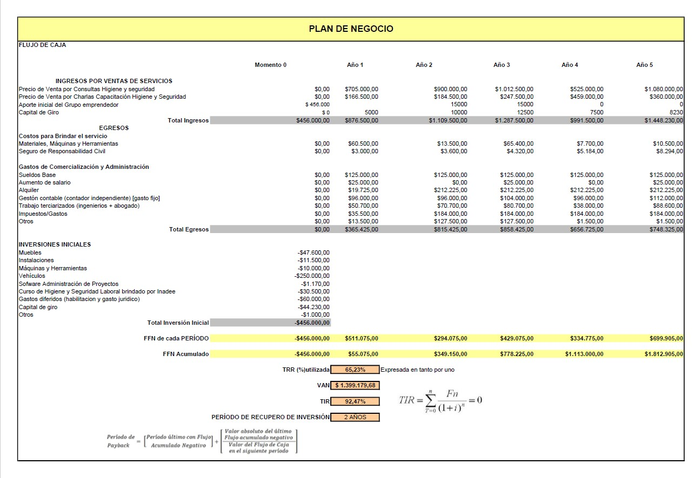

# Análisis y Reportes en Excel

Este repositorio contiene ejemplos de análisis de datos, presupuestos y reportes realizados en Excel.

Incluye modelos de presupuestos y flujos de fondos para un plan de negocio a 5 años, así como visualizaciones mediante gráficos de barras, piecharts y otros indicadores.

## Presupuestos
Modelos de presupuestos personales y de viaje, con tablas y gráficos explicativos.  
[Ver carpeta Presupuestos](Presupuestos/)

## Plan de negocio
Modelo financiero y flujo de fondos para un plan de negocio a 5 años.  
[Ver carpeta Plan de negocio](Plan_de_negocio/)

